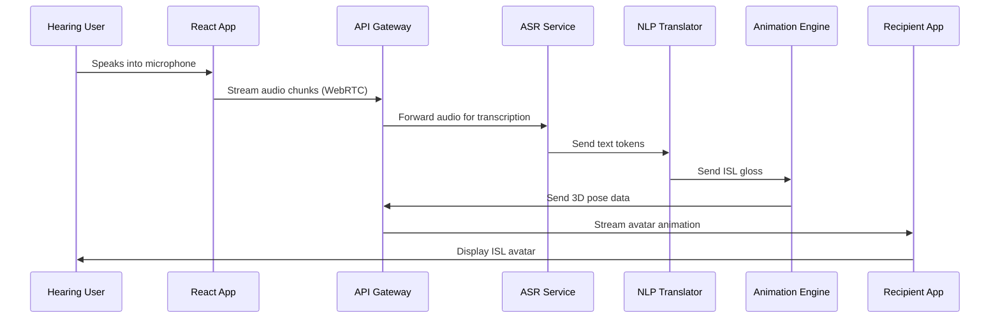
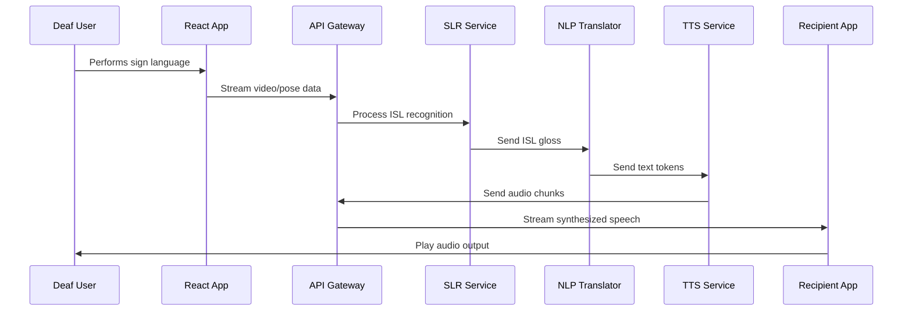

# Functional Specification Document (FSD)
## Real-time Bidirectional Voice-to-ISL & ISL-to-Voice Translation System

| Document Information | Details |
|---------------------|---------|
| **Project Name** | Real-time Bidirectional Voice-to-ISL & ISL-to-Voice Translation System |
| **Document Version** | v1.0 |
| **Date** | October 25, 2024 |
| **Status** | Draft |
| **Author** | Development Team |

---

## 1. Overview & Scope

### 1.1 Purpose
The Real-time Bidirectional Voice-to-ISL & ISL-to-Voice Translation System is designed to facilitate seamless communication between hearing individuals and deaf/hard-of-hearing individuals who use Indian Sign Language (ISL). The system provides bidirectional translation capabilities through a modern web application with real-time audio/video processing.

### 1.2 Target Users

| User Type | Description | Primary Use Cases |
|-----------|-------------|-------------------|
| **Deaf/Hard-of-Hearing Users** | Individuals who communicate primarily through ISL | Sign language to voice translation, receiving voice-to-avatar translations |
| **Hearing Users** | Individuals who communicate through spoken language | Voice to sign language translation, receiving ISL-to-voice translations |
| **System Administrators** | Technical personnel managing the system | User management, system monitoring, configuration management |

### 1.3 System Objectives
- Enable real-time bidirectional communication between hearing and deaf/hard-of-hearing individuals
- Provide accurate voice-to-ISL and ISL-to-voice translation
- Deliver an intuitive, responsive user interface accessible across devices
- Support friend management and video conversation capabilities
- Ensure scalable, cloud-ready architecture for future deployment

### 1.4 Scope of Functionalities

#### For Deaf/Hard-of-Hearing Users:
- User registration and profile management
- Friend request and management system
- Real-time ISL-to-voice translation during video conversations
- Receive voice-to-avatar ISL translations
- Access to conversation history

#### For Hearing Users:
- User registration and profile management
- Friend request and management system
- Real-time voice-to-ISL translation during conversations
- Receive ISL-to-voice translations
- Access to conversation history

#### For Administrators:
- User account management
- System performance monitoring
- Configuration management for translation models
- Analytics and usage reporting

---

## 2. System Architecture

### 2.1 High-Level Architecture

The system follows a 6-layer microservices architecture controlled by the Model Context Protocol (MCP):

| Layer | Name | Components | Responsibility |
|-------|------|------------|----------------|
| **L1** | Client Layer | Mobile/Web Apps | User interface, media capture, rendering |
| **L2** | Edge/Ingestion | Load Balancer, WAF, API Gateway | Traffic management, security, routing |
| **L3** | Control Plane | Session Manager, MCP Host | Session management, dynamic configuration |
| **L4** | Core Data Plane | ASR, SLR, NLP, Animation, TTS Services | Core processing logic |
| **L5** | Data/Persistence | H2 Database, Message Broker | Data storage, message queuing |
| **L6** | Cloud Compute | Infrastructure Services | Compute resources, scaling |

### 2.2 Technology Stack

#### Backend Components:
- **Framework**: Python with FastAPI
- **Database**: H2 Database for persistence
- **Message Broker**: Apache Kafka/RabbitMQ for async communication
- **API Gateway**: Custom FastAPI-based gateway
- **Load Balancer**: Cloud-native load balancing solution
- **Containerization**: Docker for microservices deployment

#### Frontend Components:
- **Framework**: React 18+ with TypeScript
- **UI Library**: Material-UI or Tailwind CSS for responsive design
- **State Management**: Redux Toolkit or Zustand
- **Real-time Communication**: WebRTC for audio/video, WebSockets for data
- **Build Tools**: Vite or Create React App

#### Core AI/ML Services:
- **ASR (Automatic Speech Recognition)**: Custom ASR models for Indian languages
- **SLR (Sign Language Recognition)**: Computer vision models for ISL recognition
- **NLP Translation**: Language models for text-to-gloss and gloss-to-text conversion
- **TTS (Text-to-Speech)**: Speech synthesis for natural voice output
- **Animation Engine**: 3D avatar animation system

---

## 3. Core Features Specification

### 3.1 Four-Quadrant User Interface

The main application interface is divided into four distinct quadrants, each serving a specific function in the translation workflow:

| Quadrant | Location | Function | Data Source |
|----------|----------|----------|-------------|
| **Voice Recording** | Top-Left | Captures and displays real-time audio input from hearing users | WebRTC audio stream |
| **Text Transcription** | Bottom-Left | Shows transcribed text from voice input | ASR Service output |
| **ISL Gloss Display** | Top-Right | Displays ISL gloss notation for linguistic representation | NLP Translator output |
| **Avatar Rendering** | Bottom-Right | Renders 3D ISL avatar performing sign language | Animation Engine output |

### 3.2 User Management Features

#### 3.2.1 User Registration & Authentication
```
POST /api/v1/auth/register
POST /api/v1/auth/login
POST /api/v1/auth/logout
GET /api/v1/auth/profile
PUT /api/v1/auth/profile
```

#### 3.2.2 Friend Management System
```
POST /api/v1/friends/request
PUT /api/v1/friends/accept/{friendId}
DELETE /api/v1/friends/decline/{friendId}
GET /api/v1/friends/list
DELETE /api/v1/friends/remove/{friendId}
```

#### 3.2.3 Video Conversation Management
```
POST /api/v1/conversations/start
GET /api/v1/conversations/active
PUT /api/v1/conversations/end/{conversationId}
GET /api/v1/conversations/history
```

---

## 4. Microservices Specifications

### 4.1 ASR Service (Automatic Speech Recognition)

**Purpose**: Converts incoming audio streams to text tokens in real-time.

| Specification | Details |
|---------------|---------|
| **Input** | Audio chunks via WebRTC/UDP stream |
| **Output** | Text tokens (JSON format) |
| **Processing** | Real-time speech-to-text conversion |
| **Languages Supported** | Hindi, English, Regional Indian languages |
| **Latency Target** | <200ms per audio chunk |

**API Endpoints**:
```
POST /asr/v1/transcribe/stream
GET /asr/v1/health
GET /asr/v1/models/available
```

### 4.2 SLR Service (Sign Language Recognition)

**Purpose**: Analyzes video frames to recognize ISL gestures and convert them to gloss notation.

| Specification | Details |
|---------------|---------|
| **Input** | Video frames/pose data via WebRTC stream |
| **Output** | ISL gloss sequences (JSON format) |
| **Processing** | Computer vision + temporal analysis |
| **Frame Rate** | 30 FPS processing capability |
| **Accuracy Target** | >85% gesture recognition accuracy |

**API Endpoints**:
```
POST /slr/v1/recognize/stream
GET /slr/v1/health
GET /slr/v1/models/available
```

### 4.3 NLP Translator Service

**Purpose**: Bidirectional translation between natural language text and ISL gloss notation.

| Specification | Details |
|---------------|---------|
| **Input** | Text tokens OR ISL gloss sequences |
| **Output** | ISL gloss sequences OR text tokens |
| **Processing** | Neural language models with ISL grammar rules |
| **Languages** | Hindi ↔ ISL, English ↔ ISL |
| **Context Awareness** | Maintains conversation context |

**API Endpoints**:
```
POST /nlp/v1/translate/text-to-gloss
POST /nlp/v1/translate/gloss-to-text
GET /nlp/v1/health
POST /nlp/v1/context/update
```

### 4.4 Animation Engine Service

**Purpose**: Generates 3D avatar animations from ISL gloss sequences.

| Specification | Details |
|---------------|---------|
| **Input** | ISL gloss sequences |
| **Output** | 3D pose data streams |
| **Processing** | Gloss-to-pose mapping + animation generation |
| **Avatar Models** | Customizable 3D humanoid models |
| **Rendering** | Real-time 30 FPS animation |

**API Endpoints**:
```
POST /animation/v1/generate/stream
GET /animation/v1/health
GET /animation/v1/avatars/available
PUT /animation/v1/avatars/customize
```

### 4.5 TTS Service (Text-to-Speech)

**Purpose**: Converts text tokens to natural-sounding speech audio.

| Specification | Details |
|---------------|---------|
| **Input** | Text tokens |
| **Output** | Audio chunks |
| **Processing** | Neural TTS with emotion and prosody |
| **Voices** | Multiple Indian language voices |
| **Quality** | High-fidelity speech synthesis |

**API Endpoints**:
```
POST /tts/v1/synthesize/stream
GET /tts/v1/health
GET /tts/v1/voices/available
```

---

## 5. API Specifications

### 5.1 Core API Gateway Endpoints

#### Authentication & User Management
| Endpoint | Method | Description | Request Body | Response |
|----------|--------|-------------|--------------|----------|
| `/api/v1/auth/register` | POST | User registration | `UserRegistrationRequest` | `AuthResponse` |
| `/api/v1/auth/login` | POST | User authentication | `LoginRequest` | `AuthResponse` |
| `/api/v1/auth/logout` | POST | User logout | - | `StatusResponse` |
| `/api/v1/auth/profile` | GET | Get user profile | - | `UserProfile` |
| `/api/v1/auth/profile` | PUT | Update user profile | `UserProfileUpdate` | `UserProfile` |

#### Friend Management
| Endpoint | Method | Description | Request Body | Response |
|----------|--------|-------------|--------------|----------|
| `/api/v1/friends/request` | POST | Send friend request | `FriendRequest` | `StatusResponse` |
| `/api/v1/friends/accept/{friendId}` | PUT | Accept friend request | - | `StatusResponse` |
| `/api/v1/friends/decline/{friendId}` | DELETE | Decline friend request | - | `StatusResponse` |
| `/api/v1/friends/list` | GET | Get friends list | - | `FriendsList` |
| `/api/v1/friends/remove/{friendId}` | DELETE | Remove friend | - | `StatusResponse` |

#### Translation Services
| Endpoint | Method | Description | Request Body | Response |
|----------|--------|-------------|--------------|----------|
| `/api/v1/translate/voice-to-isl` | POST | Voice to ISL translation | `VoiceInput` | `ISLOutput` |
| `/api/v1/translate/isl-to-voice` | POST | ISL to voice translation | `ISLInput` | `VoiceOutput` |
| `/api/v1/translate/stream/start` | POST | Start streaming translation | `StreamConfig` | `StreamSession` |
| `/api/v1/translate/stream/end` | POST | End streaming translation | `StreamEndRequest` | `StatusResponse` |

### 5.2 WebSocket Endpoints

| Endpoint | Purpose | Message Types |
|----------|---------|---------------|
| `/ws/translation/{sessionId}` | Real-time translation data | `AudioChunk`, `VideoFrame`, `TextToken`, `GlossSequence`, `PoseData` |
| `/ws/conversation/{conversationId}` | Conversation management | `ConversationStart`, `ConversationEnd`, `ParticipantJoin`, `ParticipantLeave` |

---

## 6. Data Models

### 6.1 User Management Models

```json
// UserRegistrationRequest
{
  "username": "string",
  "email": "string",
  "password": "string",
  "userType": "hearing | deaf | admin",
  "firstName": "string",
  "lastName": "string",
  "preferredLanguage": "string"
}

// UserProfile
{
  "userId": "uuid",
  "username": "string",
  "email": "string",
  "userType": "hearing | deaf | admin",
  "firstName": "string",
  "lastName": "string",
  "preferredLanguage": "string",
  "avatarSettings": "object",
  "createdAt": "datetime",
  "lastLoginAt": "datetime"
}

// AuthResponse
{
  "accessToken": "string",
  "refreshToken": "string",
  "expiresIn": "number",
  "userProfile": "UserProfile"
}
```

### 6.2 Translation Models

```json
// VoiceInput
{
  "audioData": "base64",
  "format": "string",
  "sampleRate": "number",
  "channels": "number",
  "sessionId": "uuid"
}

// ISLOutput
{
  "sourceText": "string",
  "islGloss": "string",
  "avatarStreamUrl": "string",
  "confidence": "number",
  "processingTime": "number"
}

// ISLInput
{
  "videoData": "base64",
  "poseData": "object",
  "format": "string",
  "frameRate": "number",
  "sessionId": "uuid"
}

// VoiceOutput
{
  "sourceGloss": "string",
  "transcribedText": "string",
  "audioStreamUrl": "string",
  "confidence": "number",
  "processingTime": "number"
}
```

### 6.3 Conversation Models

```json
// Conversation
{
  "conversationId": "uuid",
  "participants": ["uuid"],
  "startTime": "datetime",
  "endTime": "datetime",
  "status": "active | ended",
  "translationMode": "voice-to-isl | isl-to-voice | bidirectional"
}

// ConversationMessage
{
  "messageId": "uuid",
  "conversationId": "uuid",
  "senderId": "uuid",
  "messageType": "voice | isl | text",
  "content": "object",
  "timestamp": "datetime",
  "translatedContent": "object"
}
```

---

## 7. Database Schema

### 7.1 H2 Database Tables

#### Users Table
```sql
CREATE TABLE users (
    user_id UUID PRIMARY KEY DEFAULT RANDOM_UUID(),
    username VARCHAR(50) UNIQUE NOT NULL,
    email VARCHAR(100) UNIQUE NOT NULL,
    password_hash VARCHAR(255) NOT NULL,
    user_type ENUM('hearing', 'deaf', 'admin') NOT NULL,
    first_name VARCHAR(50) NOT NULL,
    last_name VARCHAR(50) NOT NULL,
    preferred_language VARCHAR(10) DEFAULT 'en',
    avatar_settings JSON,
    created_at TIMESTAMP DEFAULT CURRENT_TIMESTAMP,
    last_login_at TIMESTAMP,
    is_active BOOLEAN DEFAULT TRUE
);
```

#### Friends Table
```sql
CREATE TABLE friends (
    friendship_id UUID PRIMARY KEY DEFAULT RANDOM_UUID(),
    requester_id UUID NOT NULL,
    addressee_id UUID NOT NULL,
    status ENUM('pending', 'accepted', 'declined', 'blocked') DEFAULT 'pending',
    created_at TIMESTAMP DEFAULT CURRENT_TIMESTAMP,
    updated_at TIMESTAMP DEFAULT CURRENT_TIMESTAMP ON UPDATE CURRENT_TIMESTAMP,
    FOREIGN KEY (requester_id) REFERENCES users(user_id),
    FOREIGN KEY (addressee_id) REFERENCES users(user_id),
    UNIQUE(requester_id, addressee_id)
);
```

#### Conversations Table
```sql
CREATE TABLE conversations (
    conversation_id UUID PRIMARY KEY DEFAULT RANDOM_UUID(),
    created_by UUID NOT NULL,
    status ENUM('active', 'ended') DEFAULT 'active',
    translation_mode VARCHAR(20) NOT NULL,
    start_time TIMESTAMP DEFAULT CURRENT_TIMESTAMP,
    end_time TIMESTAMP,
    FOREIGN KEY (created_by) REFERENCES users(user_id)
);
```

#### Conversation Participants Table
```sql
CREATE TABLE conversation_participants (
    conversation_id UUID NOT NULL,
    user_id UUID NOT NULL,
    joined_at TIMESTAMP DEFAULT CURRENT_TIMESTAMP,
    left_at TIMESTAMP,
    PRIMARY KEY (conversation_id, user_id),
    FOREIGN KEY (conversation_id) REFERENCES conversations(conversation_id),
    FOREIGN KEY (user_id) REFERENCES users(user_id)
);
```

#### Translation Sessions Table
```sql
CREATE TABLE translation_sessions (
    session_id UUID PRIMARY KEY DEFAULT RANDOM_UUID(),
    conversation_id UUID,
    user_id UUID NOT NULL,
    session_type ENUM('voice-to-isl', 'isl-to-voice') NOT NULL,
    start_time TIMESTAMP DEFAULT CURRENT_TIMESTAMP,
    end_time TIMESTAMP,
    total_messages INTEGER DEFAULT 0,
    average_latency DECIMAL(10,2),
    FOREIGN KEY (conversation_id) REFERENCES conversations(conversation_id),
    FOREIGN KEY (user_id) REFERENCES users(user_id)
);
```

---

## 8. Integration Flows

### 8.1 Voice-to-ISL Translation Flow



### 8.2 ISL-to-Voice Translation Flow



### 8.3 Frontend-Backend Integration Mapping

| Frontend Component | Backend Service | Communication Protocol | Data Format |
|--------------------|-----------------|------------------------|-------------|
| Voice Recording Quadrant | ASR Service | WebRTC Audio Stream | Audio chunks (WebM/OGG) |
| Text Display Quadrant | ASR Service | WebSocket | JSON text tokens |
| ISL Gloss Quadrant | NLP Translator | WebSocket | JSON gloss sequences |
| Avatar Quadrant | Animation Engine | WebSocket | Binary 3D pose data |
| Friend Management | API Gateway | HTTP/REST | JSON requests/responses |
| User Authentication | API Gateway | HTTP/REST | JSON JWT tokens |
| Conversation Management | API Gateway | WebSocket | JSON conversation events |

---

## 9. Real-time Communication Architecture

### 9.1 WebRTC Configuration
- **Audio Codecs**: Opus, G.722, G.711
- **Video Codecs**: VP8, VP9, H.264
- **Transport**: UDP with DTLS encryption
- **Signaling**: WebSocket-based SDP exchange
- **STUN/TURN**: For NAT traversal

### 9.2 WebSocket Message Types

#### Audio Processing Messages
```json
{
  "type": "audio_chunk",
  "sessionId": "uuid",
  "data": "base64_audio_data",
  "timestamp": "number",
  "sequence": "number"
}

{
  "type": "text_token",
  "sessionId": "uuid",
  "text": "string",
  "confidence": "number",
  "timestamp": "number"
}
```

#### Video Processing Messages
```json
{
  "type": "video_frame",
  "sessionId": "uuid",
  "data": "base64_video_data",
  "timestamp": "number",
  "sequence": "number"
}

{
  "type": "pose_data",
  "sessionId": "uuid",
  "poses": "object",
  "timestamp": "number"
}
```

#### Translation Messages
```json
{
  "type": "isl_gloss",
  "sessionId": "uuid",
  "gloss": "string",
  "confidence": "number",
  "timestamp": "number"
}

{
  "type": "avatar_pose",
  "sessionId": "uuid",
  "poseData": "object",
  "timestamp": "number"
}
```

---

## 10. Error Handling & Validation

### 10.1 API Error Responses

```json
// Standard Error Response
{
  "error": {
    "code": "string",
    "message": "string",
    "details": "object",
    "timestamp": "datetime",
    "traceId": "uuid"
  }
}
```

### 10.2 Common Error Codes

| Code | Description | HTTP Status |
|------|-------------|-------------|
| `AUTH_001` | Invalid credentials | 401 |
| `AUTH_002` | Token expired | 401 |
| `AUTH_003` | Insufficient permissions | 403 |
| `USER_001` | User not found | 404 |
| `USER_002` | Username already exists | 409 |
| `TRANS_001` | Translation service unavailable | 503 |
| `TRANS_002` | Invalid audio format | 400 |
| `TRANS_003` | Translation timeout | 408 |
| `CONV_001` | Conversation not found | 404 |
| `CONV_002` | Maximum participants exceeded | 429 |

### 10.3 Input Validation Rules

#### User Registration
- Username: 3-50 characters, alphanumeric and underscore only
- Email: Valid email format, maximum 100 characters
- Password: Minimum 8 characters, at least one uppercase, lowercase, and number
- Names: 1-50 characters, letters and spaces only

#### Audio Input
- Format: WebM, OGG, WAV, MP3
- Sample Rate: 16kHz, 44.1kHz, 48kHz
- Channels: Mono or Stereo
- Maximum Duration: 30 minutes per session

#### Video Input
- Format: WebM, MP4, AVI
- Resolution: 640x480 to 1920x1080
- Frame Rate: 15-30 FPS
- Maximum Duration: 30 minutes per session

---

## 11. Performance Requirements

### 11.1 Latency Targets

| Service | Target Latency | Maximum Acceptable |
|---------|----------------|-------------------|
| ASR Service | <200ms | <500ms |
| SLR Service | <300ms | <800ms |
| NLP Translation | <150ms | <400ms |
| Animation Engine | <100ms | <300ms |
| TTS Service | <200ms | <500ms |
| End-to-End | <1000ms | <2000ms |

### 11.2 Throughput Requirements

| Metric | Target | Peak Load |
|--------|--------|-----------|
| Concurrent Users | 1,000 | 5,000 |
| Translations/Second | 100 | 500 |
| Audio Streams | 500 | 2,500 |
| Video Streams | 200 | 1,000 |
| API Requests/Second | 10,000 | 50,000 |

### 11.3 Availability Requirements

- **System Uptime**: 99.9% (8.76 hours downtime/year)
- **Recovery Time Objective (RTO)**: <15 minutes
- **Recovery Point Objective (RPO)**: <5 minutes
- **Planned Maintenance Window**: 4 hours/month

---

## 12. Security Specifications

### 12.1 Authentication & Authorization
- **Authentication Method**: JWT tokens with refresh token rotation
- **Password Security**: bcrypt hashing with salt
- **Session Management**: Secure session storage with HttpOnly cookies
- **API Security**: Rate limiting, CORS configuration, input sanitization

### 12.2 Data Protection
- **Data in Transit**: TLS 1.3 encryption for all communications
- **Data at Rest**: AES-256 encryption for sensitive data
- **Media Streams**: DTLS encryption for WebRTC communications
- **Privacy**: GDPR-compliant data handling and retention policies

### 12.3 Security Headers
```
Content-Security-Policy: default-src 'self'; script-src 'self' 'unsafe-inline'
X-Frame-Options: DENY
X-Content-Type-Options: nosniff
Strict-Transport-Security: max-age=31536000; includeSubDomains
X-XSS-Protection: 1; mode=block
```

---

## 13. Monitoring & Observability

### 13.1 Application Metrics
- **Response Time**: P50, P95, P99 percentiles for all APIs
- **Error Rate**: 4xx and 5xx error percentages
- **Throughput**: Requests per second for each service
- **Translation Accuracy**: Confidence scores and user feedback
- **Resource Utilization**: CPU, memory, disk usage per service

### 13.2 Business Metrics
- **Active Users**: Daily, weekly, monthly active users
- **Translation Volume**: Number of translations per day/hour
- **Session Duration**: Average conversation length
- **User Engagement**: Feature usage patterns
- **System Health**: Service availability and performance trends

### 13.3 Alerting Rules
- **Critical**: Service down, error rate >5%, response time >2s
- **Warning**: Error rate >2%, response time >1s, high resource usage
- **Info**: Deployment notifications, scheduled maintenance

---

## 14. Deployment Architecture

### 14.1 Local Development Setup
```bash
# Backend Services
cd backend/
python -m venv venv
source venv/bin/activate
pip install -r requirements.txt
uvicorn main:app --reload --port 8000

# Frontend Application
cd frontend/
npm install
npm run dev
```

### 14.2 Cloud Deployment Architecture
- **Container Orchestration**: Kubernetes clusters
- **Service Mesh**: Istio for service-to-service communication
- **Load Balancing**: Application Load Balancer (ALB)
- **Auto Scaling**: Horizontal Pod Autoscaler (HPA)
- **Storage**: Persistent volumes for database and media storage
- **Monitoring**: Prometheus + Grafana + Jaeger for observability

### 14.3 Environment Configuration

| Environment | Purpose | Configuration |
|-------------|---------|---------------|
| **Development** | Local development and testing | Single node, in-memory database |
| **Staging** | Pre-production testing | Multi-node, shared database |
| **Production** | Live system | High availability, distributed database |

---

## Appendices

### Appendix A: Mockup Placeholders
- **A.1**: Four-quadrant UI layout wireframe
- **A.2**: User registration and login flows
- **A.3**: Friend management interface
- **A.4**: Conversation interface with avatar rendering
- **A.5**: Admin dashboard layout

### Appendix B: API Documentation
- **B.1**: Complete OpenAPI/Swagger specification
- **B.2**: WebSocket API documentation
- **B.3**: Error code reference guide

### Appendix C: Database Scripts
- **C.1**: Database schema creation scripts
- **C.2**: Initial data seeding scripts
- **C.3**: Migration scripts for schema updates

---

*This Functional Specification Document serves as the technical blueprint for the Real-time Bidirectional Voice-to-ISL & ISL-to-Voice Translation System. It should be reviewed and updated regularly as the system evolves.*
